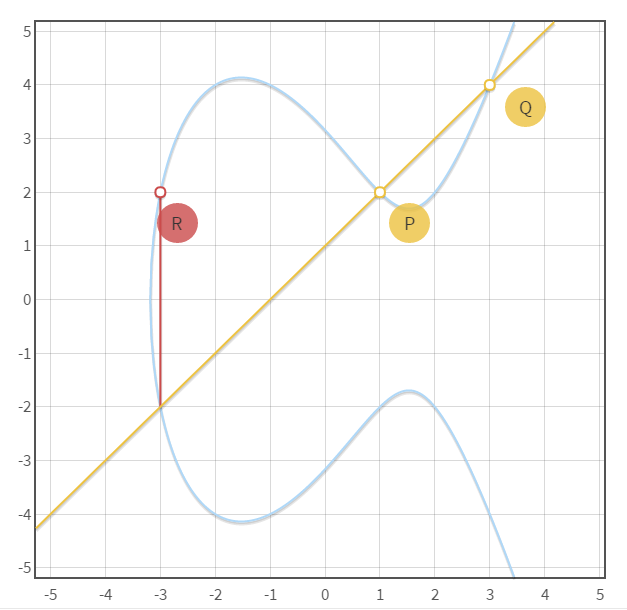
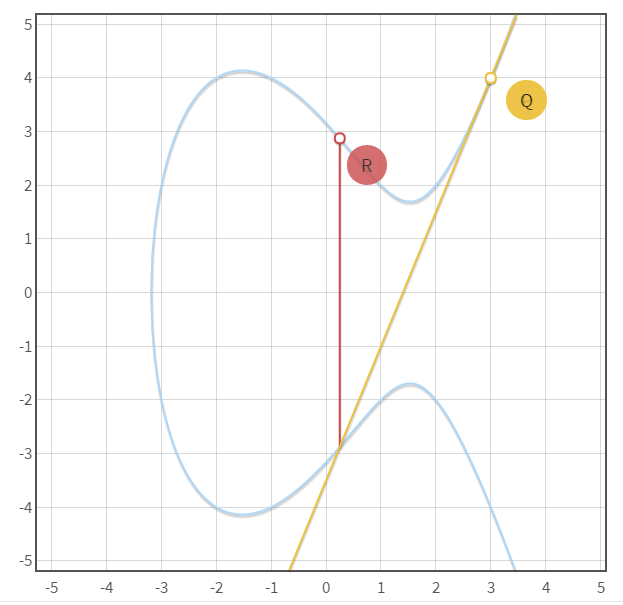
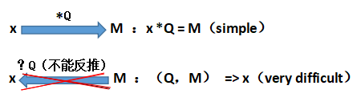

“Mimblewimble” 是国外著名影视剧《哈利·波特》中来防范黑魔法诅咒用的一种保护性口诀,正因为它是如此的奇妙，所以也用它作为命名，意图在区块链中施展一种“神奇”的“魔法”可以隐藏交易内容，但是同时又可以验证交易的正确性。

刚才我们说了mimblewimble的由来，那mimblewimble真实的技术本质又是什么呢？

首先，我们要知道mimblewimble底层都是由密码学构成，它应用了密码学中的椭圆曲线加密技术，构造perdersen commitment（皮德森承诺），然后通过一种协议完成一笔隐藏交易，那么我们先大概学习下椭圆曲线：

**椭圆曲线：**

椭圆曲线名称名称由来是因为椭圆的周长公式很像这种曲线方程，所以称为椭圆曲线，如下图就是一种简单标准的椭圆曲线，方程式为：**y****2** **= x****3** **- 7x + 10**

 

在此基础上我们定义一种“+”运算，即过椭圆曲线上的两点，构成一条直线，直线又会相较于椭圆曲线第三个点，对第三个点做垂线，垂线又会与椭圆曲线相较于另一点，该点便为两点相加之和。

 例如上图所示：椭圆曲线上两点Q，P可做一条直线，直线与椭圆曲线相交于一点，过此点又做垂线，相交于椭圆曲线上的另一点R点，整个过程是运算一种加法： **Q + P = R**

 (实际过程是在mod n的情况下进行的，即n素数域内，因为如果不在素数域里处理，加法生成的很多点，非整数，不利于处理，椭圆曲线的安全难度也不够，该部分就不详解了，想深入学习者，可以自行查找资料，本章节主要是为了介绍椭圆曲线的核心思想)

 在此基础上，我们可以做一种新的乘法扩展，譬如下图，Q+Q我们可以写作2*Q

 如上图，过椭圆曲线上的Q点做切线，即**Q+Q=R**我们可以写作**2\*Q=R** ，拓展：4*Q=R+R，...，8*Q=4*Q+4*Q，...,16*Q=8*Q+8*Q，...，32*Q=16*Q+16*Q，...，64*Q=32*Q+32*Q，...，等

 这时，就可以发现难点，假设我们经过x次Q点相加，即x*Q等于椭圆曲线上的一点假设为M，很容易算出M（如果x很大时，每次都是如上拓展叠加上去），但是如果我们不知道x，从Q，M反推x，几乎是不可能的（该问题和求对数问题是同价的，加上是在mod下计算的，也即离散的，所以该难题也被称作椭圆曲线上的离散对数问题）：  

由此，我们把x作为椭圆曲线加密的私钥，M作为公钥，只能私钥推出公钥，公钥推不出私钥（如果用暴力破解，但是当x很大很大时，比如以太坊私钥的长度256bit，除非量子计算机的出世，不然就经典计算机的运算速度是毫无可能的）

 **皮德森承诺（perdersen commitment）：**

 在我们讲完了椭圆曲线是怎样构造公私钥的之后，我们就要把该算法应用到皮德森承诺，在mimblewimble中我们需要隐藏金额v还有该承诺对应的私钥r，诸如 ：

 **C = r \* G + v \* H**  

（这里的G，H都是椭圆曲线上的**公开的**点，r，v是该承诺的私钥（也可叫做致盲因子）和金额，也可以分别当为如上章节所讲的G，H两个点各自叠加的次数，你可以通过r，v推出C，但是从C获取不了任何信息）

 如上形式的，就称C为一个perdersen承诺，其作用是为了隐藏r ，v两个值，因为椭圆曲线上的难题，你没法反推出r，v，所以在只有你拥有r，v两个值的时候，你才能通过perdersen 承诺花这笔价值为v的钱。

 在mimblewimble系统中，交易的输入输出就是这些perdersen承诺，即一个输入对应一个perdersen承诺（所以在这个系统中也就没有了地址，具有了一定的隐私性），但是如何来使整个交易成立，并且可以验证交易的正确性，在接下来的一章节，我们再详细讲解。